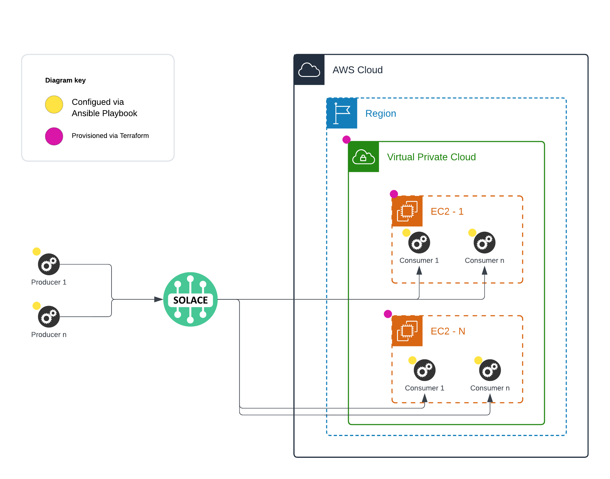

# Solace SDKPerf Tests - Ansible Automated Deployment

## Overview

This repository is a collection of Terraform and Ansible configuration files that automatically provision the infrastructure required to run Solace Broker nodes as well as SDKPerf nodes.
This Repo is based on the [Benchmark Testing](https://github.com/andrew-j-roberts/sdkperf-automation) Repo, created by [Andrew Roberts](https://github.com/andrew-j-roberts)



### Warnings

- This project makes several assumptions about the deployed architecture
  - Machine images are linux based
  - Image used for Solace PubSub+ Queue consumers contains .net 6.0
  - Terraform does not deploy machines for PubSub+ Publishers. Assumption is that the publisher is to be deployed on-prem on an existing server
  - SDKPerf scripts are executed with "nohup", limiting the ability to exit via SIGINT and aggregate specific stats such as messages sent/received and latency information. It is recommended to initiate the scripts manually if these stats are required.
  - You have an existing Solace Broker and Non-Exclusive Queue configured for use with the tests.

## Script Highlights

- Provision N number of SDKPerf nodes
- Configure SDKPerf commands
- Execute your configured SDKPerf command on all SDKPerf nodes
- Kill the SDKPerf processes on all of your SDKPerf nodes
- Clean up all resources provisionedused in test.

## List of resources to be created by Terraform

- SSH Key Pair to log into the VMs (AWS Only)
- Network VPC (If no subnet is specified)
- Network Subnet, one for each HA node (If no subnet is specified)
- Network Internet Gateway (AWS Only)
- Network Route Table (AWS Only)
- Security Group for the SDKPerf nodes
- SDKPerf Nodes, Running .NET Core 7, Mono 6.12, PowerShell 7, and MATE DE pre-installed to run your .NET applications on Amazon Linux 2 with Long Term Support (LTS).
- Ansible Inventory File containing Public IPs for SDKPerfNodes
- SDKPerf sample Ansible Playbook tests for the C & C# SDKPerf

## List of Tasks to be executed by Ansible at bootstrap:

- Copy the selected SDKPerf ex: sdkperf/sdkperf-c-x86-64

## Prerequisites

### General

- A control host that will run the Terraform & Ansible Scripts
- Install Terraform on the Host - Instructions [here](https://learn.hashicorp.com/terraform/getting-started/install.html)
- Install Ansible on the host - Instructions [here](https://docs.ansible.com/ansible/latest/installation_guide/intro_installation.html)
- - Disable host key checking by the underlying tools Ansible uses to connect to the host

```
  export ANSIBLE_HOST_KEY_CHECKING=false
```

### AWS

**Configure Terraform to use the credentials of a sufficiently privileged IAM role**  
You can do this in a number of ways, but I recommend using environment variables as a quick, easy, and secure way of passing your keys to Terraform. Instructions [here](https://www.terraform.io/docs/providers/aws/index.html#environment-variables).

```
  export AWS_ACCESS_KEY_ID="accesskey"
  export AWS_SECRET_ACCESS_KEY="secretkey"
```

## Getting Started

There are 3 main subdirectories in this repository:

- [keys](/keys) - Can be used to store the private & public keys to access via SSH the SDKPerf Nodes
- [terraform](/terraform) - Contains Terraform configuration & template files to create resources on the cloud as well as files to be used by Ansible (Inventories, Playbooks, Variables)
- [ansible](/ansible) - Contains playbooks, inventories, variables & roles to be used by Ansible to configure the VMs. There are static files that can be modified according to what is needed, as well as files that will get dynamically created by Terraform upon execution, based on the resources terraform creates (ex: number of nodes, public or private IPs, etc.).

Also, inside of each of those subdirectories, there are README files that can provide extra information as well as describing what CAN or HAS TO be configured on each section.

> :warning: The SSH keys to be used should have restrictive permissions (ex: 600), otherwise Terraform and Ansible could trigger an error while connecting to the VMs

## Creating Resources

Once all the variables and configurations have been set according to our needs, we can have Terraform create all the infrastructure for us, by going into the appropriate PATH where the Terraform resource files are located (ex: [/terraform/aws/](/terraform/aws/)) and typing the following commands:

```
  terraform init
  terraform apply
```

and typing "yes" when prompted.

## Running SDKPerf Tests

Read the [/ansible/README.md](/ansible/README.md) file

## Destroying the resources

Once the testing has concluded and the cloud resources are no longer needed, we can destroy all of them by simply going into the appropriate PATH where the Terraform resource files are located (ex: [/terraform/aws/](/terraform/aws/)) and running the Terraform command:

```
  terraform destroy
```

and typing "yes" when prompted.
